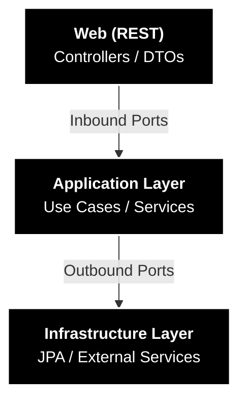
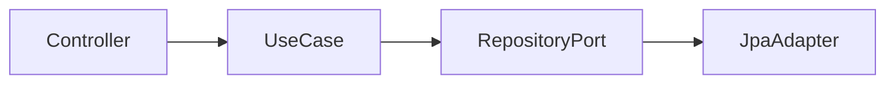

# # BridgeToTalk | Java 25 & Spring Boot 3.4 | Hexagonal Architecture, DDD & Multi-tenant SaaS

[](https://www.oracle.com/java/technologies/javase/25-downloads.html)
[](https://spring.io/projects/spring-boot)
[](https://www.postgresql.org/)
[](LICENSE)

## 🌟 Overview

**BridgetoTalk** is a modern, scalable, multi-tenant backend application designed to centralize and manage customer 
service conversations across various external channels (WhatsApp, Telegram, etc.). It serves as a comprehensive portfolio 
project demonstrating professional software architecture, domain modeling, and cloud-native readiness.

The core function is to route incoming customer messages to available human agents through a dynamic queue system, 
managing the entire lifecycle of a conversation (from **WAITING_IN_QUEUE** to **CLOSED**).

---

## 💎 Engineering Highlights

This isn't just another CRUD. It's a laboratory for high-level software engineering:

* **Rich Domain Model:** No "Anemic Models" here. Business logic (like queue availability and schedule overlaps) is encapsulated within Domain Entities and Value Objects.
* **Hexagonal Architecture:** Strict separation between business rules and infrastructure. Try swapping the database or the web framework; the domain won't care.
* **Strategic DDD:** Clear boundaries between Bounded Contexts (`attendance`, `organization`, `people`).
* **Clean Code & SOLID:** High cohesion, low coupling, and meaningful naming.
* **Value Objects:** Extensive use of Java Records to represent domain concepts like `TimeRange` and `WeeklySchedule`.

## 🏗️ Architecture and Design

This project is built using the **Hexagonal Architecture (Ports and Adapters)** principle. This structure ensures:

1.  **Domain Isolation:** The core business logic is independent of infrastructure details (e.g., Spring framework, JPA, database).
2.  **Testability:** The Application and Domain layers can be unit-tested without external dependencies.
3.  **Future-Proofing:** Easy adaptation to new technologies (e.g., migrating from PostgreSQL to DynamoDB or adding Kafka for messaging).

## 🧠 Decision Log (ADRs)

Software architecture is about trade-offs. I've documented the "why" behind major decisions:

* [ADR-001: Hexagonal Architecture](./docs/adr/ADR-001-hexagonal-architecture.md) - Why I chose Ports & Adapters over Layered Architecture.
* [ADR-003: Queue Business Hours](./docs/adr/ADR-003-queue-business-hours-modeling.md) - The logic behind flexible scheduling and overlap validation.
* [ADR-004: Domain Exceptions](./docs/adr/ADR-004-domain-exceptions-strategy.md) - Strategy for handling errors without leaking infrastructure details.

### Project Structure (Hexagonal)

The main package structure (`com.renanresende.bridgetotalk`) follows the Hexagonal layers:

* `...domain`: **Core Business Entities** and Enums (`Agent`, `Queue`, `Conversation`). No framework dependencies.
* `...application`: **Use Cases** (Business Logic). Contains **Ports** (interfaces `port.in` and `port.out`) and their **Services** (implementations).
* `...infrastructure`: **Adapters**. Handles technical details like **Web Controllers** (`web`), **Persistence** (`persistence` using Spring Data JPA), and **External Integrations** (`integration`).

## Why Hexagonal Architecture?

This project was built to demonstrate how to apply Hexagonal Architecture
(Ports & Adapters) in a real-world Spring Boot application.

Unlike simple CRUD examples, this codebase shows:

- A domain layer fully isolated from Spring and JPA
- Explicit inbound and outbound ports
- Infrastructure adapters for Web and Persistence
- Rich domain models with business rules

(Read a more explained reason in)[docs/adr/ADR-001-hexagonal-architecture.md] 

## How the architecture is organized?


                                                                                                                       


## Where to start?

If you want to understand the architecture, start here:

1. domain/organization/Company.java – core domain entity
2. domain/attendance/Queue.java, Conversation.java, Messsage.java - core domain entities to main flow of application
3. domain/people/Agent.java, Customer.java - core domain entities that represent the actors in main flow of application
2. application/port/in – use case definitions
3. application/service – business logic orchestration
4. adapter/out/jpa/* – persistence adapters


## 🛠️ Technology Stack

* **Language:** Java 25
* **Framework:** Spring Boot 3
* **Database:** PostgreSQL (using UUIDs for primary keys)
* **Build Tool:** Maven

---

## ⚙️ Initial Setup

### Prerequisites

* Java 25 JDK
* Maven 3.8+
* PostgreSQL Server (Local or Docker)

### 1. Database Configuration

Create a PostgreSQL database (e.g., `bridgetotalk`).

Configure the connection details in your `application.properties` (or `application.yml`):

```properties
# src/main/resources/application.properties
spring.datasource.url=jdbc:postgresql://localhost:5432/bridgetotalk
spring.datasource.username=your_postgres_user
spring.datasource.password=your_postgres_password
spring.jpa.hibernate.ddl-auto=validate
spring.jpa.show-sql=true0000000,
```
## 📡 API Examples (cURL)

A collection of real examples to help quickly test the API.

## 🔍 1. Get Company by ID

```curl
curl --location 'http://localhost:8080/api/v1/companies/2b28e96b-e73b-4ff2-98bb-898de3ecdd55'
```

## 🏗️ 2. Create Company

<details>
```curl
curl --location 'http://localhost:8080/api/v1/companies' \
--header 'Content-Type: application/json' \
--data-raw '{
"id": "668301bb-f6be-49bd-a315-d08a1491a186",
"name": "Cool company",
"slug": "coolcompany",
"email": "contato@startcompany.com",
"phone": "+5511999999999",
"document": "coolcompany",
"status": "ACTIVE",
"plan": "PRO",
"settings": {
"maxAgents": 20,
"maxQueues": 20,
"timezone": "America/Sao_Paulo",
"language": "pt",
"createdAt": "2025-11-21T18:05:16.756701Z",
"updatedAt": "2025-11-21T18:05:16.756706Z",
"plan": "PRO"
},
"createdAt": "2025-11-21T18:05:16.747453Z",
"updatedAt": "2025-11-21T18:05:16.747456Z"
}'
```
</details>

## 🏗️ 3. Update Company (General Info)

<details>
```curl
curl --location --request PUT 'http://localhost:8080/api/v1/companies/cb031bf8-d0c7-421a-b23e-0eeff82c825b' \
--header 'Content-Type: application/json' \
--data-raw '{
    "phone": "+5511955661111",
    "email": "newemail@startcompany.com"
}'
```
</details>

## ⚙️ 4. Update Company Settings

<details>
```curl
curl --location --request PUT 'http://localhost:8080/api/v1/companies/cb031bf8-d0c7-421a-b23e-0eeff82c825b/settings' \
--header 'Content-Type: application/json' \
--data '{
"maxAgents": 57,
"maxQueues": 57,
"timezone": "America/Sao_Paulo",
"language": "pt",
"plan": "ENTERPRISE"
}'
```
</details>