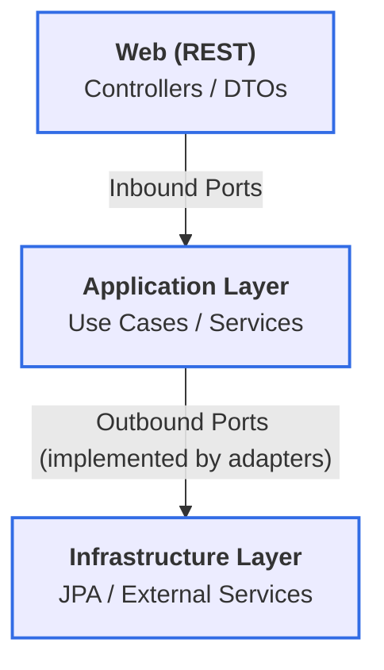
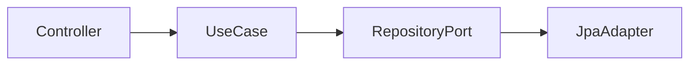

# BridgeToTalk — Java 25, Spring Boot 4, Hexagonal Architecture (Ports & Adapters), DDD, Multi-Tenant SaaS


[](https://www.oracle.com/java/technologies/javase/25-downloads.html)
[](https://spring.io/projects/spring-boot)
[](https://www.postgresql.org/)
[-orange)](docs/architecture/2-hexagonal-architecture.md)
[-blueviolet)](docs/architecture/3-domain-structure.md)
[]()
[]()
[](LICENSE)

## 🌟 Overview

**BridgetoTalk** is a modern, scalable, multi-tenant backend application designed to centralize and manage customer 
service conversations across various external channels (WhatsApp, Telegram, etc.). It serves as a comprehensive portfolio 
project demonstrating professional software architecture, domain modeling, and cloud-native readiness.

This project is intentionally designed as a reference implementation for backend engineers who want to s
tudy architecture beyond CRUD-based examples.

The core function is to route incoming customer messages to available human agents through a dynamic queue system, 
managing the entire lifecycle of a conversation (from **WAITING_IN_QUEUE** to **CLOSED**).

---

## 🎯 Who is this project for?

This project is ideal for:

- Java developers studying **Hexagonal Architecture (Ports & Adapters)**
- Engineers learning **DDD in real-world Spring Boot applications**
- Developers looking for **non-trivial, non-CRUD** backend examples
- Professionals preparing architectural portfolios
- Teams exploring **multi-tenant SaaS backend design**

---

## 💎 Engineering Highlights

This isn't just another CRUD. It's a laboratory for high-level software engineering:

* **Rich Domain Model:** No "Anemic Models" here. Business logic (like queue availability and schedule overlaps) is encapsulated within Domain Entities and Value Objects.
* **Hexagonal Architecture:** Strict separation between business rules and infrastructure. Try swapping the database or the web framework, 
the domain won't care, because he domain has zero dependencies on Spring or JPA.
* **Strategic DDD:** Clear boundaries between Bounded Contexts (`attendance`, `organization`, `people`).
* **Clean Code & SOLID:** High cohesion, low coupling, and meaningful naming.
* **Value Objects:** Extensive use of Java Records to represent domain concepts like `TimeRange` and `WeeklySchedule`.

## 🏗️ Architecture and Design

This project is built using the **Hexagonal Architecture (Ports and Adapters)** principle. This structure ensures:

1.  **Domain Isolation:** The core business logic is independent of infrastructure details (e.g., Spring framework, JPA, database).
2.  **Testability:** The Application and Domain layers can be unit-tested without external dependencies.
3.  **Future-Proofing:** Easy adaptation to new technologies (e.g., migrating from PostgreSQL to DynamoDB or adding Kafka for messaging).

## 🧠 Decision Log (ADRs)

Software architecture is about trade-offs. I've documented the "why" behind major decisions:

* [ADR-001: Hexagonal Architecture](./docs/adr/ADR-001-hexagonal-architecture.md) - Why I chose Ports & Adapters over Layered Architecture.
* [ADR-003: Queue Business Hours](./docs/adr/ADR-003-queue-business-hours-modeling.md) - The logic behind flexible scheduling and overlap validation.
* [ADR-004: Domain Exceptions](./docs/adr/ADR-004-domain-exceptions-strategy.md) - Strategy for handling errors without leaking infrastructure details.

---

### Project Structure (Hexagonal)

The main package structure (`com.renanresende.bridgetotalk`) follows the Hexagonal layers:

* `...domain`: **Core Business Entities** and Enums (`Agent`, `Queue`, `Conversation`). No framework dependencies.
* `...application`: **Use Cases** (Business Logic). Contains **Ports** (interfaces `port.in` and `port.out`) and their **Services** (implementations).
* `...infrastructure`: **Adapters**. Handles technical details like **Web Controllers** (`web`), **Persistence** (`persistence` using Spring Data JPA), and **External Integrations** (`integration`).

## Why Hexagonal Architecture?

This project was built to demonstrate how to apply Hexagonal Architecture
(Ports & Adapters) in a real-world Spring Boot application.

Unlike simple CRUD examples, this codebase shows:

- A domain layer fully isolated from Spring and JPA
- Explicit inbound and outbound ports
- Infrastructure adapters for Web and Persistence
- Rich domain models with business rules

[Read a more explained reason in ADR-001](./docs/adr/ADR-001-hexagonal-architecture.md)

## How the architecture is organized?


                                                                                                                       


## Where to start?

If you want to understand the architecture, start here:

1. domain/organization/Company.java, CompanySettings.java – core domain entity
2. domain/attendance/Queue.java, Conversation.java, Message.java - core domain entities to main flow of application
3. domain/people/Agent.java, Customer.java - core domain entities that represent the actors in main flow of application
4. application/port/in – use case definitions
5. application/service – business logic orchestration
6. adapter/out/jpa/* – persistence adapters


## 🛠️ Technology Stack

* **Language:** Java 25
* **Framework:** Spring Boot 4
* **Database:** PostgreSQL (using UUIDs for primary keys)
* **Build Tool:** Maven

---

## ⚙️ Initial Setup

### Prerequisites

* Java 25 JDK
* Maven 3.8+
* PostgreSQL Server (Local or Docker)


### 🚀 Running with Docker (Recommended)

You can run the entire application **without installing Java or Maven**.

### Requirements
- Docker
- Docker Compose

### Start the application

```bash
docker compose up --build
```

This will start:

- PostgreSQL database
- Spring Boot API (Java 25, Spring Boot 4)

  The application will be available at:


```
http://localhost:8080
```

#### Verify Health Status

```
curl --location 'http://localhost:8080/api/v1/actuator/health'
```
Expected response: 

```json
{"status":"UP"}
```

### 🧑‍💻 Running Locally (Java 25)

If you prefer to run the application without Docker:

### Requirements
- Java 25
- Maven 3.8+
- PostgreSQL

### Run

```bash
./mvnw spring-boot:run
```

## 🧪 Testing the API
Once the application is running, you can use the cURL examples provided below to interact with the system.

The API follows REST principles and uses UUIDs for all identifiers to ensure global uniqueness and prevent ID enumeration,
a standard practice for secure multi-tenant SaaS.

## 📡 API Examples (cURL)

A collection of real examples to help quickly test the API.
See [docs/api.md](./docs/api.md) for more details.

## Roadmap

- [Agents skill](./docs/design-notes/skill-based-routing.md) to allows conversations to be handled by 
agents who are better prepared to resolve specific types of issues;
- Integration with popular messaging platforms (Facebook Message, Intagran, Telegram, WhatsApp, etc.);
- Kafka/RabbitMQ/AWS SQS integration for message events;
- Redis cache for active queues;


## ⭐ Contributing & Feedback

If this project helped you understand Hexagonal Architecture or DDD in Java,
consider giving it a ⭐.

Feedback, discussions, and architectural suggestions are very welcome.
